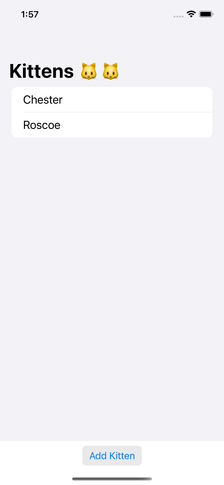
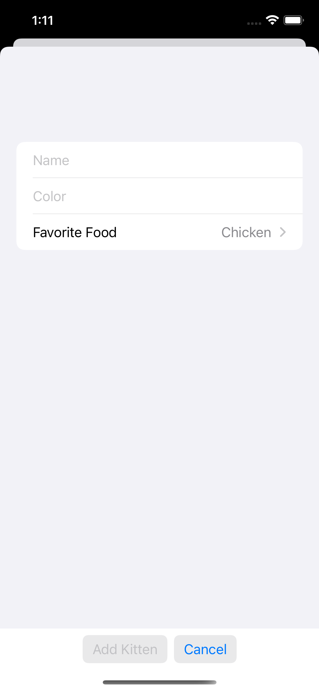
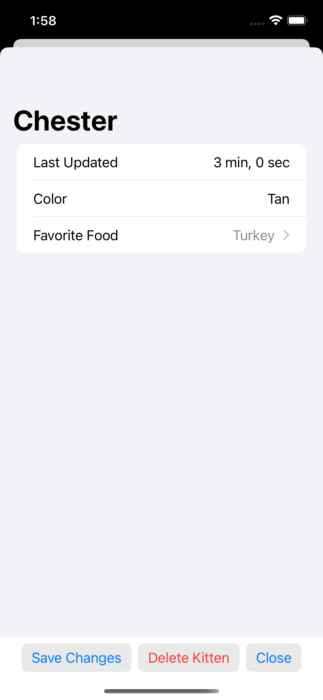

# Kittens iOS Frontend

This application has an iOS frontend written using SwiftUI. The frontend has two dependencies:
* The local [Models](../Models/) package, containing data model types shared between the backend and frontend
* [swift-bson](https://github.com/mongodb/swift-bson), a BSON library, used for its support for serializing to/deserializing from extended JSON

The application follows the Model-View-ViewModel (MVVM) pattern, where we define model types, views, and view models, which model the data that is contained in each view. Since the models are defined in the [Models](../Models) package, only the views and view models are defined within the iOS code.

The application has three SwiftUI `View`s, each defined in a file in the [Kittens/Views](./Kittens/Views) directory:
* `KittenList` displays a list of kittens.
* `AddKitten` supports adding a new kitten
* `UpdateDeleteKitten` displays information about a kitten and supports updating and deleting a kitten

    

_From left to right, the `KittenList` view, `AddKitten` view, and `UpdateDeleteKitten` view._

Each `View` has a corresponding view model in [Kittens/ViewModels](./Kittens/ViewModels/), which models all of the data and state used in the `View` and contains logic for interacting with the backend server and updating the stored data as needed. 

The view models use convenience methods defined in [Kittens/Utilities.swift](./Kittens/) for sending HTTP requests and handling their responses.
